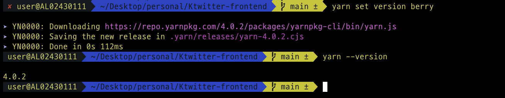

### Version
``` bath
TypeScript: v20
React: v18
Next.js: v14
yarn: v4.0.2
```
### Project Setting


```bash
npm install -g yarn
cd {workspace}
yarn set version berry
yarn --version
```



```bash
yarn install
yarn dev
```

Open [http://localhost:3000](http://localhost:3000) with your browser to see the result.
